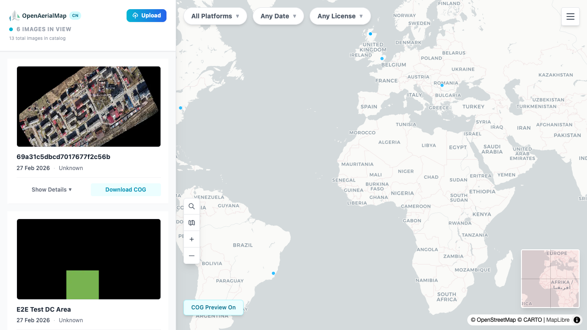

# Cloud-Native OpenAerialMap (cn-oam)

A radically lean reimagining of [OpenAerialMap](https://openaerialmap.org) where the entire backend is files on S3, queried by the browser. No databases, no tile servers, no 24/7 services.

**Live demo:** https://cgiovando.github.io/cn-oam/



## How it works

```
s3://cn-oam/
├── catalog.parquet           ← GeoParquet catalog (searched client-side via DuckDB-WASM)
├── catalog/pending/*.parquet ← sidecar files from recent uploads (pre-merge)
├── imagery/{id}.tif          ← Cloud Optimized GeoTIFFs (web-optimized, EPSG:3857)
├── thumbnails/{id}.webp      ← image thumbnails
└── app/                      ← static frontend SPA
```

The browser does everything:

| Function | How | Server needed? |
|----------|-----|:--------------:|
| **Search** | DuckDB-WASM queries `catalog.parquet` via HTTP range requests | No |
| **Browse map** | MapLibre loads footprints as GeoJSON from catalog | No |
| **Preview imagery** | `maplibre-cog-protocol` reads COGs directly from S3 | No |
| **Upload** | Presigned S3 URL from a single Lambda function | 1 Lambda (~50ms) |

**What runs 24/7: Nothing.** Estimated cost: ~$60/month for 20K images.

## Architecture

```
┌──────────────────────────────────────────────┐
│              BROWSER                          │
│  MapLibre GL JS + DuckDB-WASM + COG protocol │
└──────────┬──────────────┬────────────────────┘
           │              │
           ▼              ▼
┌──────────────────────────────────────────────┐
│                 S3 BUCKET                     │
│  catalog.parquet · imagery/*.tif · thumbs    │
└──────────────────────┬───────────────────────┘
                       │ S3 Event (on upload)
                       ▼
         ┌─────────────────────────┐
         │   Serverless Pipeline   │
         │  upload-auth · process  │
         │  image · rebuild-catalog│
         └─────────────────────────┘
```

Three Lambda functions handle uploads:

1. **upload-auth** — validates API key, returns presigned S3 PUT URL
2. **process-image** — converts to web-optimized COG, generates thumbnail, writes sidecar parquet
3. **rebuild-catalog** — merges sidecar parquets into `catalog.parquet` (hourly)

See [docs/architecture.md](docs/architecture.md) for the full design.

## Tech stack

| Layer | Technology |
|-------|-----------|
| Frontend | React + Vite + Tailwind CSS |
| Map | MapLibre GL JS |
| Imagery | COGs via `maplibre-cog-protocol` |
| Search | DuckDB-WASM on remote GeoParquet |
| Upload pipeline | AWS SAM (API Gateway + Lambda) |
| Processing | Python 3.12 + GDAL + rio-cogeo (container Lambda) |
| Hosting | GitHub Pages (frontend), S3 (data) |

## Development

### Prerequisites

- Node.js 18+
- A [Mapbox access token](https://account.mapbox.com/) (for satellite basemap)

### Setup

```bash
cd frontend
npm install
cp .env.example .env   # add your Mapbox token
npm run dev
```

The dev server runs at `http://localhost:5173/cn-oam/`.

### Environment variables

| Variable | Description |
|----------|-------------|
| `VITE_MAPBOX_TOKEN` | Mapbox access token (satellite basemap) |
| `VITE_CATALOG_URL` | GeoParquet catalog URL (defaults to S3) |
| `VITE_UPLOAD_API_URL` | Upload API Gateway URL |

### Deploy infrastructure

The upload pipeline is defined as an AWS SAM template:

```bash
cd infra
sam build --use-container
sam deploy --profile admin --parameter-overrides "UploadApiKey=$API_KEY"
```

## Project structure

```
cn-oam/
├── frontend/               # React SPA
│   ├── src/
│   │   ├── components/     # Map, Sidebar, ImageCard, UploadModal, etc.
│   │   └── lib/catalog.js  # DuckDB-WASM integration
│   └── public/
│       └── catalog.parquet # GeoParquet catalog (10 real OAM images)
├── functions/              # Lambda functions
│   ├── upload-auth/        # API key validation + presigned URL
│   ├── process-image/      # COG conversion + thumbnail + metadata
│   └── rebuild-catalog/    # GeoParquet merge + Hilbert sort
├── infra/                  # SAM template
├── scripts/                # ETL and migration utilities
└── docs/                   # Architecture documentation
```

## Key design decisions

1. **No database** — GeoParquet IS the catalog
2. **No tile server** — COGs read directly by the browser via HTTP range requests
3. **No API server** — DuckDB-WASM does search client-side
4. **Serverless only** — nothing runs when nobody is using it
5. **STAC-compatible** — catalog follows stac-geoparquet spec

## AI-assisted development

> This project was developed with significant assistance from AI coding tools.

- **[Claude Code](https://claude.ai/claude-code)** (Anthropic) — code generation, architecture, debugging, and documentation
- All functionality has been tested and verified to work as intended
- Features and infrastructure choices have been reviewed and approved by the maintainer

This disclosure follows emerging best practices for transparency in AI-assisted software development.

## License

[MIT](LICENSE)
